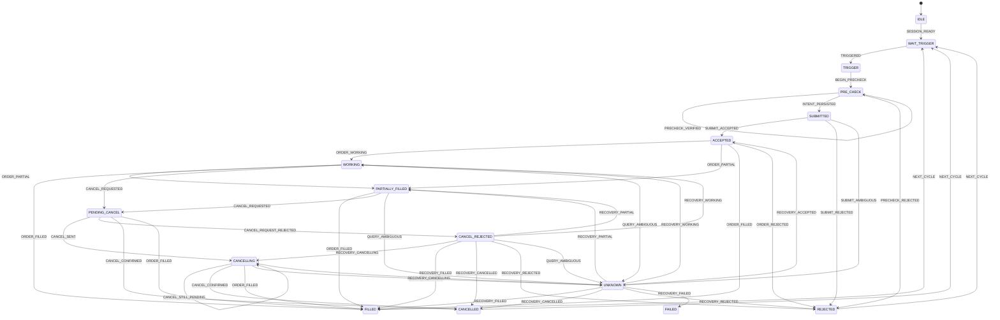

# Generic Trading Execution State Machine

This document is the normative execution-model contract for `qmt-execution-core`.
It is broker- and strategy-independent.

## 1. Scope

The component answers only execution questions:

```text
Can this request safely be submitted now?
What is the durable execution state?
What broker observation is authoritative?
How is an uncertain submit/cancel recovered?
How is a crash resumed without duplicate orders?
```

It does **not** decide trading signals, target allocations, grid parameters, Core holdings, or portfolio strategy.

## 2. States

```text
IDLE
WAIT_TRIGGER
TRIGGER
PRE_CHECK
SUBMITTED
ACCEPTED
WORKING
PARTIALLY_FILLED
PENDING_CANCEL
CANCELLING
CANCEL_REJECTED
UNKNOWN
FILLED
CANCELLED
REJECTED
FAILED
```

High-level lifecycle:



The Python `TRANSITIONS` table is the exact executable source of truth if this diagram and code ever differ.

## 3. SafetyFacts

The abstract machine carries facts rather than treating state names as proof:

```python
SafetyFacts(
    environment_verified=False,
    account_verified=False,
    broker_snapshot_verified=False,
    position_verified=False,
    cash_verified=False,
    quote_verified=False,
    intent_persisted=False,
    reservation_persisted=False,
    unresolved_order=False,
    terminal_order_confirmed=False,
    submitted_once=False,
    cancel_intent_persisted=False,
)
```

`SESSION_READY` cannot self-certify readiness; it requires a `SessionEvidence` object.
`PRECHECK_VERIFIED` cannot self-certify cash/position/quote state; it requires a complete `PrecheckEvidence` object supplied by the execution guard.

## 4. Core invariants

### INV-001 — verified session

Every broker-side execution path must retain verified environment and account facts.

### INV-002 — fresh precheck before durable intent

`INTENT_PERSISTED` is only legal after the current cycle proves:

```text
broker_snapshot_verified
position_verified
cash_verified
quote_verified
```

This guard prevents a later cycle from reusing stale precheck facts.

### INV-003 — durable intent/reservation before possible submit

```text
submitted_once == true
=> intent_persisted == true
AND reservation_persisted == true
```

### INV-004 — unresolved order cannot enter a new-order path

```text
unresolved_order == true
=> state not in WAIT_TRIGGER / TRIGGER / PRE_CHECK
```

### INV-005 — cancel intent precedes cancel side effect

`PENDING_CANCEL`, `CANCELLING`, and `CANCEL_REJECTED` require `cancel_intent_persisted`.

### INV-006 — successful terminal state requires broker confirmation

`FILLED` and `CANCELLED` require:

```text
terminal_order_confirmed == true
unresolved_order == false
```

### INV-007 — UNKNOWN has no blind retry path

`UNKNOWN` contains only query/recovery outcomes. It cannot directly submit another intent or begin a new execution cycle.

## 5. Durable ordering

Submit order:

```text
verify session/precheck
→ persist intent + reservation evidence
→ journal INTENT_PERSISTED transition
→ broker place_order side effect
→ persist broker order id when known
→ query/reconcile broker state
```

Cancel order:

```text
persist cancel intent
→ journal CANCEL_REQUESTED transition
→ broker cancel side effect
→ authoritative re-query
→ state-aware terminal/nonterminal transition
```

`cancel()` acknowledgement is never proof that the order was cancelled.

## 6. UNKNOWN recovery

If submit outcome is ambiguous and no broker order id is durable:

```text
query all managed broker orders
→ match exact durable identity
   order_remark + symbol + side + qty
→ exactly one match required
```

Zero matches and multiple matches are both ambiguous. Zero is **not** permission to resend because an order may have reached the broker but not yet be visible.

If a durable broker order id exists, recovery queries that exact order id.

## 7. Restart recovery

`ExecutionSession.open()` acquires the cross-process mutex **before any journal I/O**.
A nonterminal in-flight journal is moved to `UNKNOWN` through `RESTART_RECOVERY`, then broker-authoritative reconciliation determines the next state.

An interrupted pre-submit `TRIGGER/PRE_CHECK` run fails closed rather than silently resetting.

## 8. Mutex ownership

The session owns `ExecutionMutex` for its entire open lifetime.
`close()` releases the lock and irreversibly closes that session object. Public execution methods also verify current mutex ownership, so loss of lock ownership cannot leave an order-capable object.

## 9. Formal verification

`verify_state_machine()` performs exhaustive explicit-state reachability to a fixed point across `TradeState × SafetyFacts` states reachable under the guarded transitions.
It verifies:

- every declared state is reachable;
- every declared transition is reachable in at least one valid fact context;
- every reachable state satisfies invariants;
- every reachable nonterminal state has a path to a terminal state;
- `UNKNOWN` contains no new-order/blind-retry transitions.

It also emits:

```text
transition_spec_sha256
execution_source_sha256
```

The source manifest is fail-closed: a missing protected execution source raises verification failure.

## 10. Verification boundary

Formal model verification proves the abstract model, not arbitrary Python runtime behavior.
Therefore every broker adapter must also provide refinement tests proving:

```text
broker/API observation
→ normalized broker state
→ correct abstract event for current TradeState
```

A release gate should require both model verification and runtime refinement tests.
